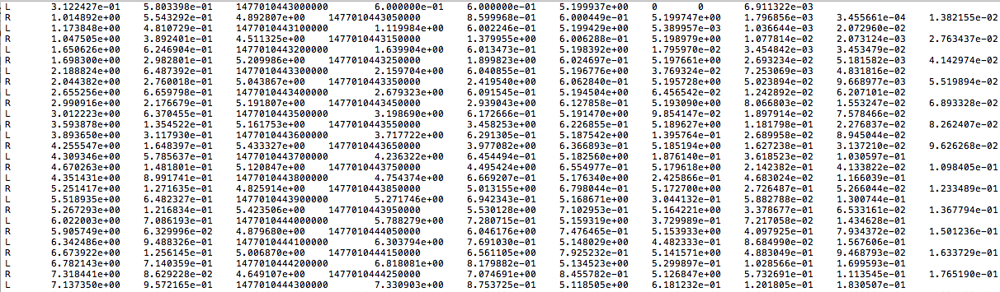

# **Extended Kalman Filter**

In this project, we used [Extended Kalman Filters](https://en.wikipedia.org/wiki/Extended_Kalman_filter), lidar and radar measurements to track a moving object's position and velocity.

## Lidar and Radar Measurement Data
The input file used in this project is [here](./data/obj_pose-laser-radar-synthetic-input.txt).\
 \
The lidar and rader measurement data format is as follows: \
#L(for laser) meas_px meas_py timestamp gt_px gt_py gt_vx gt_vy\
#R(for radar) meas_rho meas_phi meas_rho_dot timestamp gt_px gt_py gt_vx gt_vy

The first column for each row represents the sensor type.\
For a radar row, the columns are: sensor_type, rho_measured, phi_measured, rhodot_measured, timestamp, x_groundtruth, y_groundtruth, vx_groundtruth, vy_groundtruth, yaw_groundtruth, yawrate_groundtruth.\
For a lidar row, the columns are: sensor_type, x_measured, y_measured, timestamp, x_groundtruth, y_groundtruth, vx_groundtruth, vy_groundtruth, yaw_groundtruth, yawrate_groundtruth.

## Algorithm

Algorithm Map (source Udacity)\

We have a moving bicycle. Its state is represented by a 2D position and a 2D velocity. Each time we received new measurements from a given sensor, the [process measurement functions](./src/FusionEKF.h) is triggered. At the first iteration, we just initialize the state and covariance matrix. Subsequently, we call the [prediction and update functions](./src/kalman_filter.h).
#### Why use the Extended Kalman Filter? 
Radar data are in polar coordinates. We need to map the state vector x into polar coordinates when updating with radar measurements. The coordinate mapping is non-linear. The Kalman Filter is less than sufficient. So we used the first order Taylor expansion to provide an estimated linear mapping function.

## Performance Evaluation
We used the root mean squared error to evaluate how far the estimated result is from the true result. The error we get using is:
| State | Error |
| ------ | --------|
|x | 0.0972256 |
|y | 0.0853761 |
|v_x | 0.450855 |
|v_y | 0.439588 |

We also turned off radar or lidar and compare the errors.

The results showed that using both the lidar and radar measurement data resulted in a lower error than using either of the sensor alone.

Lidar measurements are red circles, radar measurements are blue circles with an arrow pointing in the direction of the observad angle, and estimation markers are green triangles.
## Compile and Running the Project
From the root of the repo:
1. mkdir build && cd build
2. cmake .. && make
3. ./ExtendedKF
